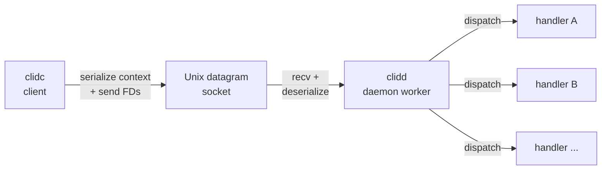
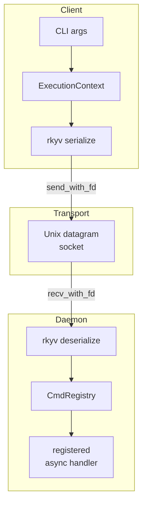

# clid

> A Rust framework for building CLI→daemon execution hand-off systems

`clid` lets you build a minimal CLI client that serializes its execution context (command, args, cwd, environment) and file descriptors (stdin/stdout/stderr), sends them over a Unix domain socket to a long-running daemon, and exits. The daemon receives the context and FDs, then dispatches to registered async handlers.

## Why

Keep your client binary tiny and fast. The daemon does the heavy lifting — it's already warm, already initialized, already connected to databases or caches. The client just hands off and gets out of the way.

## Architecture

## Crates

| Crate | Description |
| --- | --- |
| `clid` | Umbrella crate, re-exports everything |
| `clid-context` | Serializable execution context (rkyv-based) |
| `clid-discovery` | Socket discovery strategies (feature-gated: `local`, `xdg`, `env`) |
| `clid-client` | Client library: serialize context, pass FDs, exit |
| `clid-daemon` | Daemon library: receive, deserialize, dispatch to async handlers |

## Execution Context

What gets transferred from client to daemon:

| Field | Description |
| --- | --- |
| `command` | Program name to execute |
| `args` | Argument vector |
| `working_dir` | Current working directory |
| `env` | Environment variables |

Along with file descriptors for stdin, stdout, and stderr.

## Discovery

The client needs to find the daemon's socket. Strategies are feature-gated so you only compile what you need:

- **`local`** — Look for `clid.sock` (or `.clid.sock`) in the current directory
- **`env`** — Read from `CLID_SOCKET` environment variable
- **`xdg`** — Use `$XDG_RUNTIME_DIR/clid.sock`

Priority: CLI argument → env var → local file → XDG runtime dir.

## Example

See `examples/clidd` (reference daemon) and `examples/clidc` (reference client) for a working example.

## Optional: Prefork

The `clid-daemon` crate has an optional `prefork` feature (powered by the [`prefork`](https://crates.io/crates/prefork) crate) that forks worker processes. Without it, the daemon uses tokio async tasks.

## Feature Flags

| Feature | `clid` | `clid-discovery` | `clid-daemon` | `clid-context` | Description |
| --- | --- | --- | --- | --- | --- |
| `local` | ✓ forwards | ✓ enables | ✓ enables socket creation | — | Local file socket discovery |
| `env` | ✓ forwards | ✓ enables | — | — | Environment variable socket discovery |
| `xdg` | ✓ forwards | ✓ enables | — | — | XDG runtime dir socket discovery |
| `prefork` | ✓ forwards | — | ✓ enables | — | Preforked worker processes via `prefork` crate |
| `check-bytes` | ✓ forwards | — | — | ✓ enables | rkyv byte validation |

All features default to off on individual crates. The `clid` umbrella crate enables `local`, `xdg`, and `env` by default.

## License

Apache-2.0
